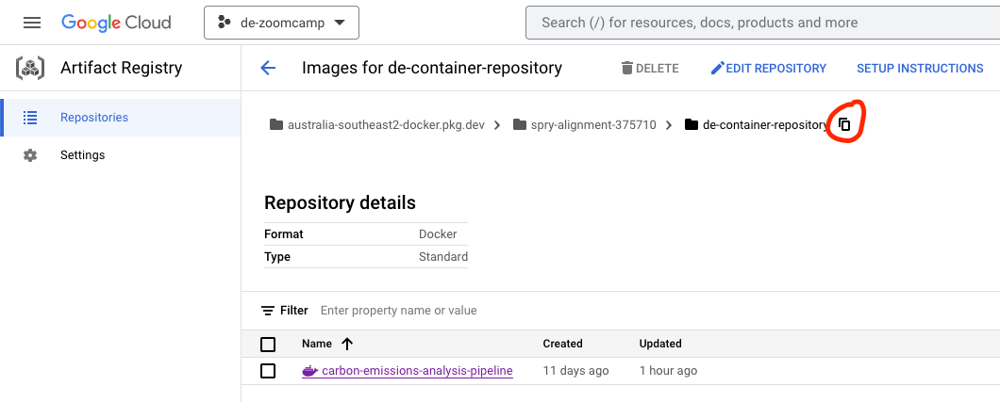
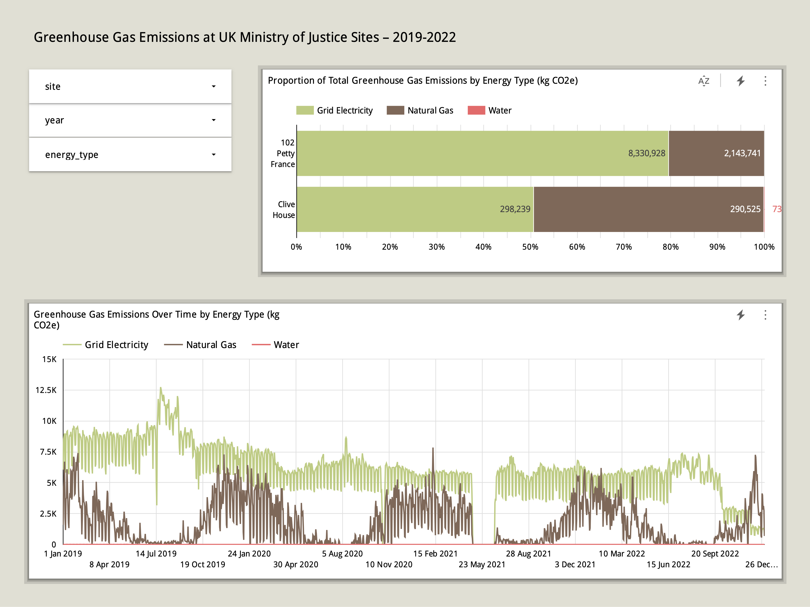

# carbon-emissions-analysis-pipeline
A data engineering pipeline to facilitate analysis of carbon emissions at UK Ministry of Justice buildings.

I've been asked to produce a report on carbon emissions at UK Ministry of Justice buildings over the past five years. This can be achieved by ingesting:
1. energy consumption data - http://www.ecodriver.uk.com/eCMS/Viewfiles.asp?folder=MOJ
2. greenhouse gas conversion factors - https://www.gov.uk/government/publications/greenhouse-gas-reporting-conversion-factors-2021

and transforming them into a single end-user table to support analysis.
> **Note**: due to difficulties opening this file type, I have downloaded it, re-exported it with Excel and saved it in _/flows/data/_

## Solution:
- Batch ingestion orchestrated by Prefect
- BigQuery to warehouse data (see below for notes on optimisation)
- dbt to transform data
- Looker to produce report
- Terraform to manage GCP infrastructure

## Instructions:
The following are required to run this project:

> **Note**: running this project will incur some costs if you've already exhausted your allocation of free credits

- a [GCP account](https://cloud.google.com/)
- a [Prefect Cloud account](https://app.prefect.cloud/auth/login)
- [Terraform](https://developer.hashicorp.com/terraform/tutorials/aws-get-started/install-cli) installed
- GNU Make installed
    - Linux: `sudo apt install make`
    - MacOS: `brew install make`
    - Windows: `choco install make`
- [Python 3.9.x](https://realpython.com/lessons/pyenv-install-python/)

1. Set up a GCP project and a service account with the following roles, then download your service account auth keys - [instructions here](https://github.com/DataTalksClub/data-engineering-zoomcamp/blob/main/week_1_basics_n_setup/1_terraform_gcp/2_gcp_overview.md#initial-setup):
    - Artifact Registry Administrator
    - BigQuery Admin
    - Cloud Run Admin
    - Service Account User
    - Storage Admin
    - Storage Object Admin
    - Viewer

    You will also need to enable the following APIs (some may be enabled by default):
    - https://console.cloud.google.com/apis/library/artifactregistry.googleapis.com
    - https://console.cloud.google.com/apis/library/bigquery.googleapis.com
    - https://console.cloud.google.com/apis/library/bigquerymigration.googleapis.com
    - https://console.cloud.google.com/apis/library/bigquerystorage.googleapis.com
    - https://console.cloud.google.com/apis/library/cloudapis.googleapis.com
    - https://console.cloud.google.com/apis/library/clouddebugger.googleapis.com
    - https://console.cloud.google.com/apis/library/cloudtrace.googleapis.com
    - https://console.cloud.google.com/apis/library/compute.googleapis.com
    - https://console.cloud.google.com/apis/library/ontainerregistry.googleapis.com
    - https://console.cloud.google.com/apis/library/datastore.googleapis.com
    - https://console.cloud.google.com/apis/library/iam.googleapis.com
    - https://console.cloud.google.com/apis/library/iamcredentials.googleapis.com
    - https://console.cloud.google.com/apis/library/logging.googleapis.com
    - https://console.cloud.google.com/apis/library/monitoring.googleapis.com
    - https://console.cloud.google.com/apis/library/oslogin.googleapis.com
    - https://console.cloud.google.com/apis/library/pubsub.googleapis.com
    - https://console.cloud.google.com/apis/library/run.googleapis.com
    - https://console.cloud.google.com/apis/library/servicemanagement.googleapis.com
    - https://console.cloud.google.com/apis/library/serviceusage.googleapis.com
    - https://console.cloud.google.com/apis/library/sql-component.googleapis.com
    - https://console.cloud.google.com/apis/library/storage-api.googleapis.com
    - https://console.cloud.google.com/apis/library/storage-component.googleapis.com
    - https://console.cloud.google.com/apis/library/storage.googleapis.com

2. From the root directory, run `pipenv install` followed by `pipenv shell` to install the necessary dependencies in a virtual environment

3. Follow these [instructions](https://discourse.prefect.io/t/how-to-get-started-with-prefect-cloud-2-0/539) to create an API key and connect your CLI to your Cloud workspace

4. Replace the values marked with "replace" in _/terraform/variables.tf_ then run `terraform -chdir=terraform apply` to create a GCS bucket, BiqQuery dataset and tables, and an Artifact Registry repository.

5. Replace the environment variables in the first block of the _.env_ file with values relevant to your project
    > **Note**: the path to the credentials file must be an absolute path
    - this image shows where to find the address of your container repository:
    
    
6. Run `pip install -e .` to install the blocks and flows code as modules
    
7. Run `make setup` to perform the following actions:
    - build a Docker image containing the environment and code to run the Prefect flows
    - push the Docker image to the Artifact Registry
    - create Prefect configuration blocks
    - create deployments for the flows to ingest and transform data
    - launch a Prefect agent to run the deployments

8. Open a new terminal window and run `bash run_data_ingestion_backfill.sh` to trigger parallelized data ingestion flows. You can monitor the progress in the Prefect Cloud UI.

9. Once finished, run `bash run_data_transformation.sh` to trigger the dbt transformation flow. You can monitor the progrss in the Prefect Cloud UI

10. Click on this link to view the dashboard built on top of the transformed data in BigQuery - https://lookerstudio.google.com/s/sK-dDaR7EjY
    

### BiqQuery Optimisation
- The energy consumption datasets use time partitioning (using the date field from the raw data) with month-level granularity, as downstream queries will most often be querying energy use in a specific month or subset of months. 
- The conversion factors datasets are clustered on four "category" columns, as these represent the logical grouping of the records and downstream queries will most often resemble `select * from table where category = '...'`
